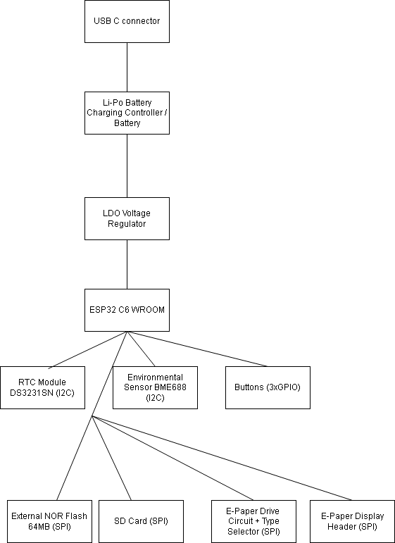

# Proiect-TSC
Proiect-TSC Stoica Rares-Nicolae 333CA

| Part          | Value                                                                          | Device                                                                         | Footprint Name                                         | Detailed Description                                                                                                                                                                                                                                                                                                                                                                                                                                                                                 | CHECK_PRICES                                                                                                                                                      |
|:--------------|:-------------------------------------------------------------------------------|:-------------------------------------------------------------------------------|:-------------------------------------------------------|:-----------------------------------------------------------------------------------------------------------------------------------------------------------------------------------------------------------------------------------------------------------------------------------------------------------------------------------------------------------------------------------------------------------------------------------------------------------------------------------------------------|:------------------------------------------------------------------------------------------------------------------------------------------------------------------|
| BOOT_BUTTON   | BUTTON_CUSYOMV1                                                                | BUTTON_CUSYOMV1                                                                | MYBUTTON                                               |                                                                                                                                                                                                                                                                                                                                                                                                                                                                                                      | https://industry.panasonic.com/global/en/products/control/switch/light-touch/number/evqpuj02k                                                                     |
| C1            | 100nF                                                                          | ESP32_WROVER_EAGLE-LTSPICE_CC0402                                              | ESP32_WROVER_EAGLE-LTSPICE_C0402                       | CAPACITOR, European symbol                                                                                                                                                                                                                                                                                                                                                                                                                                                                           | https://componentsearchengine.com/part-view/CC0402MRX5R5BB106/YAGEO                                                                                               |
| C1_BAT        | 4.7uF                                                                          | ESP32_WROVER_EAGLE-LTSPICE_CC0402                                              | ESP32_WROVER_EAGLE-LTSPICE_C0402                       | CAPACITOR, European symbol                                                                                                                                                                                                                                                                                                                                                                                                                                                                           |                                                                                                                                                                   |
| C1_BAT1       | 4.7uF                                                                          | EAGLE-LTSPICE_C0402                                                            | EAGLE-LTSPICE_C0402                                    | CAPACITOR, European symbol                                                                                                                                                                                                                                                                                                                                                                                                                                                                           | https://componentsearchengine.com/part-view/R0402%201%25%20100%20K%20(RC0402FR-07100KL)/YAGEO                                                                     |
| C1_BAT2       | 4.7uF                                                                          | EAGLE-LTSPICE_CC0402                                                           | EAGLE-LTSPICE_C0402                                    | CAPACITOR, European symbol                                                                                                                                                                                                                                                                                                                                                                                                                                                                           |                                                                                                                                                                   |
| C2            | 100nF                                                                          | ESP32_WROVER_EAGLE-LTSPICE_CC0402                                              | ESP32_WROVER_EAGLE-LTSPICE_C0402                       | CAPACITOR, European symbol                                                                                                                                                                                                                                                                                                                                                                                                                                                                           |                                                                                                                                                                   |
| C2_BAT\       | 4.7uF                                                                          | ESP32_WROVER_EAGLE-LTSPICE_CC0402                                              | ESP32_WROVER_EAGLE-LTSPICE_C0402                       | CAPACITOR, European symbol                                                                                                                                                                                                                                                                                                                                                                                                                                                                           |                                                                                                                                                                   |
| C3            | 100uF TANT                                                                     | RCL_CPOL-EUCT3528                                                              | RCL_CT3528                                             | POLARIZED CAPACITOR, European symbol                                                                                                                                                                                                                                                                                                                                                                                                                                                                 | https://a360.co/4iZy6AA                                                                                                                                           |
| C4            | 4.7uF/25V                                                                      | ESP32_WROVER_EAGLE-LTSPICE_CC0402                                              | ESP32_WROVER_EAGLE-LTSPICE_C0402                       | CAPACITOR, European symbol                                                                                                                                                                                                                                                                                                                                                                                                                                                                           |                                                                                                                                                                   |
| C4_USB        | 100nF                                                                          | ESP32_WROVER_EAGLE-LTSPICE_CC0402                                              | ESP32_WROVER_EAGLE-LTSPICE_C0402                       | CAPACITOR, European symbol                                                                                                                                                                                                                                                                                                                                                                                                                                                                           |                                                                                                                                                                   |
| C5            | 1uF                                                                            | ESP32_WROVER_EAGLE-LTSPICE_CC0402                                              | ESP32_WROVER_EAGLE-LTSPICE_C0402                       | CAPACITOR, European symbol                                                                                                                                                                                                                                                                                                                                                                                                                                                                           |                                                                                                                                                                   |
| C5_USB        | 4.7uF                                                                          | ESP32_WROVER_EAGLE-LTSPICE_CC0402                                              | ESP32_WROVER_EAGLE-LTSPICE_C0402                       | CAPACITOR, European symbol                                                                                                                                                                                                                                                                                                                                                                                                                                                                           |                                                                                                                                                                   |
| C6            | 100nF                                                                          | ESP32_WROVER_EAGLE-LTSPICE_CC0402                                              | ESP32_WROVER_EAGLE-LTSPICE_C0402                       | CAPACITOR, European symbol                                                                                                                                                                                                                                                                                                                                                                                                                                                                           |                                                                                                                                                                   |
| C7            | 10uF                                                                           | ESP32_WROVER_EAGLE-LTSPICE_CC0402                                              | ESP32_WROVER_EAGLE-LTSPICE_C0402                       | CAPACITOR, European symbol                                                                                                                                                                                                                                                                                                                                                                                                                                                                           |                                                                                                                                                                   |
| C8            | 100nF                                                                          | ESP32_WROVER_EAGLE-LTSPICE_CC0402                                              | ESP32_WROVER_EAGLE-LTSPICE_C0402                       | CAPACITOR, European symbol                                                                                                                                                                                                                                                                                                                                                                                                                                                                           |                                                                                                                                                                   |
| C9            | 100nF                                                                          | EAGLE-LTSPICE_CC0402                                                           | EAGLE-LTSPICE_C0402                                    | CAPACITOR, European symbol                                                                                                                                                                                                                                                                                                                                                                                                                                                                           |                                                                                                                                                                   |
| C10           | 100nF                                                                          | ESP32_WROVER_EAGLE-LTSPICE_CC0402                                              | ESP32_WROVER_EAGLE-LTSPICE_C0402                       | CAPACITOR, European symbol                                                                                                                                                                                                                                                                                                                                                                                                                                                                           |                                                                                                                                                                   |
| C10_SUPERCAP  | CPH3225A                                                                       | CPH3225A                                                                       | CAPCP3225X100N                                         | Cap 0.011F 3.3V 1210 Flat Check availability                                                                                                                                                                                                                                                                                                                                                                                                                                                         | https://www.snapeda.com/parts/CPH3225A/Seiko+Instruments/view-part/?ref=eda                                                                                       |
| CHANGE_BUTTON | BUTTON_CUSYOMV1                                                                | BUTTON_CUSYOMV1                                                                | MYBUTTON                                               |                                                                                                                                                                                                                                                                                                                                                                                                                                                                                                      | https://industry.panasonic.com/global/en/products/control/switch/light-touch/number/evqpuj02k                                                                     |
| CHG_LED       |                                                                                | ADAFRUIT_LEDCHIP-LED0603                                                       | ADAFRUIT_CHIP-LED0603                                  | LED                                                                                                                                                                                                                                                                                                                                                                                                                                                                                                  | https://www.snapeda.com/parts/KP-1608SURCK/Kingbright/view-part/?ref=search&t=LED%200603 SAU https://www.snapeda.com/parts/7012X1/VCC/view-part/?ref=search&t=led |
| C_DELAY       | 100nF                                                                          | ESP32_WROVER_EAGLE-LTSPICE_CC0402                                              | ESP32_WROVER_EAGLE-LTSPICE_C0402                       | CAPACITOR, European symbol                                                                                                                                                                                                                                                                                                                                                                                                                                                                           |                                                                                                                                                                   |
| D1            | USBLC6-2SC6Y                                                                   | USBLC6-2SC6Y                                                                   | SOT95P280X145-6N                                       | Low Cap. ESD Protection Auto SOT-23-6 STMicroelectronics USBLC6-2SC6Y, Dual Uni-Directional TVS Diode Array, 6-Pin SOT-23                                                                                                                                                                                                                                                                                                                                                                            | https://www.snapeda.com/parts/USBLC6-2SC6Y/STMicroelectronics/view-part/?ref=eda                                                                                  |
| D2            | ESP32_WROVER_AVX---SD0805S020S1R0_AVX_SD0805S020S1R0_0_0AVX_SD0805S020S1R0_0_0 | ESP32_WROVER_AVX---SD0805S020S1R0_AVX_SD0805S020S1R0_0_0AVX_SD0805S020S1R0_0_0 | ESP32_WROVER_AVX---SD0805S020S1R0_AVX_SD0805S020S1R0_0 | Schottky Barrier Rectifier Diode                                                                                                                                                                                                                                                                                                                                                                                                                                                                     | https://eu.mouser.com/ProductDetail/KYOCERA-AVX/SD0805S020S1R0?qs=jCA%252BPfw4LHbpkAoSnwrdjw%3D%3D                                                                |
| D3            | MBR0530                                                                        | MBR0530                                                                        | SOD3716X135N                                           | ON SEMICONDUCTOR - MBR0530 - DIODE, SCHOTTKY, 0.5A, 30V, SOD-123                                                                                                                                                                                                                                                                                                                                                                                                                                     | https://eu.mouser.com/ProductDetail/KYOCERA-AVX/SD0805S020S1R0?qs=jCA%252BPfw4LHbpkAoSnwrdjw%3D%3D                                                                |
| D4            | MBR0530                                                                        | MBR0530                                                                        | SOD3716X135N                                           | ON SEMICONDUCTOR - MBR0530 - DIODE, SCHOTTKY, 0.5A, 30V, SOD-123                                                                                                                                                                                                                                                                                                                                                                                                                                     | https://www.snapeda.com/parts/MBR0530/Onsemi/view-part/?ref=eda                                                                                                   |
| D5            | MBR0530                                                                        | MBR0530                                                                        | SOD3716X135N                                           | ON SEMICONDUCTOR - MBR0530 - DIODE, SCHOTTKY, 0.5A, 30V, SOD-123                                                                                                                                                                                                                                                                                                                                                                                                                                     | https://www.snapeda.com/parts/MBR0530/Onsemi/view-part/?ref=eda                                                                                                   |
| D6            | PGB1010603MR                                                                   | PGB1010603MR                                                                   | DIOC1608X36N                                           | Check availability                                                                                                                                                                                                                                                                                                                                                                                                                                                                                   | https://www.snapeda.com/parts/PGB1010603MR/Littelfuse/view-part/?ref=eda                                                                                          |
| D7            | ESP32_WROVER_AVX---SD0805S020S1R0_AVX_SD0805S020S1R0_0_0AVX_SD0805S020S1R0_0_0 | ESP32_WROVER_AVX---SD0805S020S1R0_AVX_SD0805S020S1R0_0_0AVX_SD0805S020S1R0_0_0 | ESP32_WROVER_AVX---SD0805S020S1R0_AVX_SD0805S020S1R0_0 | Schottky Barrier Rectifier Diode                                                                                                                                                                                                                                                                                                                                                                                                                                                                     | https://eu.mouser.com/ProductDetail/KYOCERA-AVX/SD0805S020S1R0?qs=jCA%252BPfw4LHbpkAoSnwrdjw%3D%3D                                                                |
| D8            | PGB1010603MR                                                                   | PGB1010603MR                                                                   | DIOC1608X36N                                           | Check availability                                                                                                                                                                                                                                                                                                                                                                                                                                                                                   | https://www.snapeda.com/parts/PGB1010603MR/Littelfuse/view-part/?ref=eda                                                                                          |
| D9            | PGB1010603MR                                                                   | PGB1010603MR                                                                   | DIOC1608X36N                                           | Check availability                                                                                                                                                                                                                                                                                                                                                                                                                                                                                   | https://www.snapeda.com/parts/PGB1010603MR/Littelfuse/view-part/?ref=eda                                                                                          |
| D10           | PGB1010603MR                                                                   | PGB1010603MR                                                                   | DIOC1608X36N                                           | Check availability                                                                                                                                                                                                                                                                                                                                                                                                                                                                                   | https://www.snapeda.com/parts/PGB1010603MR/Littelfuse/view-part/?ref=eda                                                                                          |
| D11           | PGB1010603MR                                                                   | PGB1010603MR                                                                   | DIOC1608X36N                                           | Check availability                                                                                                                                                                                                                                                                                                                                                                                                                                                                                   | https://www.snapeda.com/parts/PGB1010603MR/Littelfuse/view-part/?ref=eda                                                                                          |
| D12           | PGB1010603MR                                                                   | PGB1010603MR                                                                   | DIOC1608X36N                                           | Check availability                                                                                                                                                                                                                                                                                                                                                                                                                                                                                   | https://www.snapeda.com/parts/PGB1010603MR/Littelfuse/view-part/?ref=eda                                                                                          |
| EPD_C1        | 1uF/50V                                                                        | ESP32_WROVER_EAGLE-LTSPICE_CC0402                                              | ESP32_WROVER_EAGLE-LTSPICE_C0402                       | CAPACITOR, European symbol                                                                                                                                                                                                                                                                                                                                                                                                                                                                           |                                                                                                                                                                   |
| EPD_C2        | 1uF/50V                                                                        | ESP32_WROVER_EAGLE-LTSPICE_CC0402                                              | ESP32_WROVER_EAGLE-LTSPICE_C0402                       | CAPACITOR, European symbol                                                                                                                                                                                                                                                                                                                                                                                                                                                                           |                                                                                                                                                                   |
| EPD_C5        | 1uF/50V                                                                        | ESP32_WROVER_EAGLE-LTSPICE_CC0402                                              | ESP32_WROVER_EAGLE-LTSPICE_C0402                       | CAPACITOR, European symbol                                                                                                                                                                                                                                                                                                                                                                                                                                                                           |                                                                                                                                                                   |
| EPD_C6        | 1uF/50V                                                                        | ESP32_WROVER_EAGLE-LTSPICE_CC0402                                              | ESP32_WROVER_EAGLE-LTSPICE_C0402                       | CAPACITOR, European symbol                                                                                                                                                                                                                                                                                                                                                                                                                                                                           |                                                                                                                                                                   |
| EPD_C7        | 1uF/50V                                                                        | ESP32_WROVER_EAGLE-LTSPICE_CC0402                                              | ESP32_WROVER_EAGLE-LTSPICE_C0402                       | CAPACITOR, European symbol                                                                                                                                                                                                                                                                                                                                                                                                                                                                           |                                                                                                                                                                   |
| EPD_C8        | 1uF/50V                                                                        | ESP32_WROVER_EAGLE-LTSPICE_CC0402                                              | ESP32_WROVER_EAGLE-LTSPICE_C0402                       | CAPACITOR, European symbol                                                                                                                                                                                                                                                                                                                                                                                                                                                                           |                                                                                                                                                                   |
| EPD_C9        | 1uF/50V                                                                        | ESP32_WROVER_EAGLE-LTSPICE_CC0402                                              | ESP32_WROVER_EAGLE-LTSPICE_C0402                       | CAPACITOR, European symbol                                                                                                                                                                                                                                                                                                                                                                                                                                                                           |                                                                                                                                                                   |
| EPD_C10       | 1uF/50V                                                                        | ESP32_WROVER_EAGLE-LTSPICE_CC0402                                              | ESP32_WROVER_EAGLE-LTSPICE_C0402                       | CAPACITOR, European symbol                                                                                                                                                                                                                                                                                                                                                                                                                                                                           |                                                                                                                                                                   |
| EPD_C11       | 1uF/50V                                                                        | ESP32_WROVER_EAGLE-LTSPICE_CC0402                                              | ESP32_WROVER_EAGLE-LTSPICE_C0402                       | CAPACITOR, European symbol                                                                                                                                                                                                                                                                                                                                                                                                                                                                           |                                                                                                                                                                   |
| EPD_C12       | 1uF/50V                                                                        | ESP32_WROVER_EAGLE-LTSPICE_CC0402                                              | ESP32_WROVER_EAGLE-LTSPICE_C0402                       | CAPACITOR, European symbol                                                                                                                                                                                                                                                                                                                                                                                                                                                                           |                                                                                                                                                                   |
| IC1           | BD5229G-TR                                                                     | BD5229G-TR                                                                     | SOT95P280X125-5N                                       | Voltage Detector with Adjustable Delay Time: CMOS processes are utilized to develop high precision, low current consumption CMOS reset ICs that allow arbitrary setting of the delay time. The extensive lineup includes both Nch Open Drain and CMOS output types in a wide range of detection voltages (from 2.3V to 6.0V, in 0.1V steps), enabling selection of the ideal solution based on customer requirements. In addition, the entire series is of course both lead-free and RoHS-compliant. | https://componentsearchengine.com/part-view/BD5229G-TR/ROHM%20Semiconductor                                                                                       |
| IC4           | XC6220A331MR-G                                                                 | XC6220A331MR-G                                                                 | SOT95P280X120-5N                                       | LDO Voltage Regulators                                                                                                                                                                                                                                                                                                                                                                                                                                                                               | https://componentsearchengine.com/part-view/XC6220A331MR-G/Torex                                                                                                  |
| J1            | FH34SRJ-24S-0.5SH_99_                                                          | FH34SRJ-24S-0.5SH_99_                                                          | FH34SRJ24S05SH99                                       | 24 Position FFC, FPC Connector Contacts, Top and Bottom 0.020 (0.50mm) Surface Mount, Right Angle"                                                                                                                                                                                                                                                                                                                                                                                                   | https://componentsearchengine.com/part-view/XC6220A331MR-G/Torex                                                                                                  |
| J2            | SAMACSYS_PARTS_USB4110-GF-A                                                    | SAMACSYS_PARTS_USB4110-GF-A                                                    | SAMACSYS_PARTS_USB4110GFA                              | CONN USB 2.0 TYPE-C R/A SMT                                                                                                                                                                                                                                                                                                                                                                                                                                                                          | https://componentsearchengine.com/part-view/USB4110-GF-A/GCT%20(GLOBAL%20CONNECTOR%20TECHNOLOGY)                                                                  |
| J3            | QWIIC_RIGHT_ANGLE                                                              | QWIIC_CONNECTORJS-1MM                                                          | JST04_1MM_RA                                           | SparkFun I2C Standard Qwiic Connector                                                                                                                                                                                                                                                                                                                                                                                                                                                                |                                                                                                                                                                   |
| J4            | 112A-TAAR-R03_ATTEND                                                           | 112A-TAAR-R03_ATTEND                                                           | 112ATAARR03ATTEND                                      | Micro SD Card Socket, Push-Push Type, Top Mount, SMT, H=1.83mm, 10u                                                                                                                                                                                                                                                                                                                                                                                                                                  | https://store.comet.srl.ro/Catalogue/Product/43497/                                                                                                               |
| L1            | 68uH                                                                           | 744043680IND_4828-WE-TPC_WRE                                                   | IND_4828-WE-TPC_WRE                                    |                                                                                                                                                                                                                                                                                                                                                                                                                                                                                                      | https://eu.mouser.com/ProductDetail/Wurth-Elektronik/744043680?qs=PGXP4M47uW6VkZq%252BkzjrHA%3D%3D                                                                |
| PFMF.050.1    | ESP32C6_VARISTORCN1812                                                         | ESP32C6_VARISTORCN1812                                                         | ESP32C6_VARISTOR_CT/CN1812                             | VARISTOR                                                                                                                                                                                                                                                                                                                                                                                                                                                                                             | https://www.mouser.co.uk/ProductDetail/EPCOS-TDK/B72520T0350K062?qs=dEfas%2FXlABIszF52uu7vrg%3D%3D                                                                |
| Q1            | 20V/4.2A/52mO/1.4W                                                             | ESP32_WROVER_SPARKFUN-DISCRETESEMI_MOSFET_PCH-DMG2305UX-7                      | ESP32_WROVER_SPARKFUN-DISCRETESEMI_SOT23-3             | P-channel MOSFETs                                                                                                                                                                                                                                                                                                                                                                                                                                                                                    | https://componentsearchengine.com/part-view/DMG2305UX-7/Diodes%20Incorporated                                                                                     |
| Q2            | 20V/4.2A/52mO/1.4W                                                             | ESP32_WROVER_SPARKFUN-DISCRETESEMI_MOSFET_PCH-DMG2305UX-7                      | ESP32_WROVER_SPARKFUN-DISCRETESEMI_SOT23-3             | P-channel MOSFETs                                                                                                                                                                                                                                                                                                                                                                                                                                                                                    |                                                                                                                                                                   |
| Q3            | SI1308EDL-T1-GE3                                                               | D8                                                                             | SOT65P210X110-3N                                       | MOSFET N-Ch 30V 1.5A TrenchFET SC70 Vishay Si1308EDL-T1-GE3 N-channel MOSFET Transistor, 1.5 A, 30 V, 3-Pin SC-70                                                                                                                                                                                                                                                                                                                                                                                    | https://componentsearchengine.com/part-view/SI1308EDL-T1-GE3/Vishay                                                                                               |
| R1            | 10K                                                                            | ESP32_WROVER_EAGLE-LTSPICE_RR0402                                              | ESP32_WROVER_EAGLE-LTSPICE_R0402                       | RESISTOR, European symbol                                                                                                                                                                                                                                                                                                                                                                                                                                                                            |                                                                                                                                                                   |
| R1-PINH       | 10K                                                                            | ESP32_WROVER_EAGLE-LTSPICE_RR0402                                              | ESP32_WROVER_EAGLE-LTSPICE_R0402                       | RESISTOR, European symbol                                                                                                                                                                                                                                                                                                                                                                                                                                                                            |                                                                                                                                                                   |
| R1-PINH1      | 10K                                                                            | ESP32_WROVER_EAGLE-LTSPICE_RR0402                                              | ESP32_WROVER_EAGLE-LTSPICE_R0402                       | RESISTOR, European symbol                                                                                                                                                                                                                                                                                                                                                                                                                                                                            |                                                                                                                                                                   |
| R1_BAT        | 200                                                                            | ESP32_WROVER_EAGLE-LTSPICE_RR0402                                              | ESP32_WROVER_EAGLE-LTSPICE_R0402                       | RESISTOR, European symbol                                                                                                                                                                                                                                                                                                                                                                                                                                                                            |                                                                                                                                                                   |
| R1_PWRUSB     | 100K                                                                           | ESP32_WROVER_EAGLE-LTSPICE_RR0402                                              | ESP32_WROVER_EAGLE-LTSPICE_R0402                       | RESISTOR, European symbol                                                                                                                                                                                                                                                                                                                                                                                                                                                                            |                                                                                                                                                                   |
| R2            | 2.2                                                                            | ESP32_WROVER_EAGLE-LTSPICE_RR0402                                              | ESP32_WROVER_EAGLE-LTSPICE_R0402                       | RESISTOR, European symbol                                                                                                                                                                                                                                                                                                                                                                                                                                                                            | https://componentsearchengine.com/part-view/R0402%201%25%20100%20K%20(RC0402FR-07100KL)/YAGEO                                                                     |
| R2-PINH       | 10K                                                                            | ESP32_WROVER_EAGLE-LTSPICE_RR0402                                              | ESP32_WROVER_EAGLE-LTSPICE_R0402                       | RESISTOR, European symbol                                                                                                                                                                                                                                                                                                                                                                                                                                                                            |                                                                                                                                                                   |
| R2-PINH1      | 10K                                                                            | ESP32_WROVER_EAGLE-LTSPICE_RR0402                                              | ESP32_WROVER_EAGLE-LTSPICE_R0402                       | RESISTOR, European symbol                                                                                                                                                                                                                                                                                                                                                                                                                                                                            |                                                                                                                                                                   |
| R2-USB        | 5k1                                                                            | ESP32_WROVER_EAGLE-LTSPICE_RR0402                                              | ESP32_WROVER_EAGLE-LTSPICE_R0402                       | RESISTOR, European symbol                                                                                                                                                                                                                                                                                                                                                                                                                                                                            |                                                                                                                                                                   |
| R2-USB1       | 5k1                                                                            | ESP32_WROVER_EAGLE-LTSPICE_RR0402                                              | ESP32_WROVER_EAGLE-LTSPICE_R0402                       | RESISTOR, European symbol                                                                                                                                                                                                                                                                                                                                                                                                                                                                            |                                                                                                                                                                   |
| R2_BAT        | 2K                                                                             | ESP32_WROVER_EAGLE-LTSPICE_RR0402                                              | ESP32_WROVER_EAGLE-LTSPICE_R0402                       | RESISTOR, European symbol                                                                                                                                                                                                                                                                                                                                                                                                                                                                            |                                                                                                                                                                   |
| R3            | 10K                                                                            | ESP32_WROVER_EAGLE-LTSPICE_RR0402                                              | ESP32_WROVER_EAGLE-LTSPICE_R0402                       | RESISTOR, European symbol                                                                                                                                                                                                                                                                                                                                                                                                                                                                            |                                                                                                                                                                   |
| R4            | 10K                                                                            | ESP32_WROVER_EAGLE-LTSPICE_RR0402                                              | ESP32_WROVER_EAGLE-LTSPICE_R0402                       | RESISTOR, European symbol                                                                                                                                                                                                                                                                                                                                                                                                                                                                            |                                                                                                                                                                   |
| R5            | 10K                                                                            | ESP32_WROVER_EAGLE-LTSPICE_RR0402                                              | ESP32_WROVER_EAGLE-LTSPICE_R0402                       | RESISTOR, European symbol                                                                                                                                                                                                                                                                                                                                                                                                                                                                            |                                                                                                                                                                   |
| R6            | 10K                                                                            | ESP32_WROVER_EAGLE-LTSPICE_RR0402                                              | ESP32_WROVER_EAGLE-LTSPICE_R0402                       | RESISTOR, European symbol                                                                                                                                                                                                                                                                                                                                                                                                                                                                            |                                                                                                                                                                   |
| R7            | 10K                                                                            | ESP32_WROVER_EAGLE-LTSPICE_RR0402                                              | ESP32_WROVER_EAGLE-LTSPICE_R0402                       | RESISTOR, European symbol                                                                                                                                                                                                                                                                                                                                                                                                                                                                            |                                                                                                                                                                   |
| R8            | 10K                                                                            | ESP32_WROVER_EAGLE-LTSPICE_RR0402                                              | ESP32_WROVER_EAGLE-LTSPICE_R0402                       | RESISTOR, European symbol                                                                                                                                                                                                                                                                                                                                                                                                                                                                            |                                                                                                                                                                   |
| R9            | 10K                                                                            | ESP32_WROVER_EAGLE-LTSPICE_RR0402                                              | ESP32_WROVER_EAGLE-LTSPICE_R0402                       | RESISTOR, European symbol                                                                                                                                                                                                                                                                                                                                                                                                                                                                            |                                                                                                                                                                   |
| R10           | 10K                                                                            | ESP32_WROVER_EAGLE-LTSPICE_RR0402                                              | ESP32_WROVER_EAGLE-LTSPICE_R0402                       | RESISTOR, European symbol                                                                                                                                                                                                                                                                                                                                                                                                                                                                            |                                                                                                                                                                   |
| RESET_BUTTON  | BUTTON_CUSYOMV1                                                                | BUTTON_CUSYOMV1                                                                | MYBUTTON                                               |                                                                                                                                                                                                                                                                                                                                                                                                                                                                                                      | https://industry.panasonic.com/global/en/products/control/switch/light-touch/number/evqpuj02k                                                                     |
| R_BOOT        | 10K                                                                            | ESP32_WROVER_EAGLE-LTSPICE_RR0402                                              | ESP32_WROVER_EAGLE-LTSPICE_R0402                       | RESISTOR, European symbol                                                                                                                                                                                                                                                                                                                                                                                                                                                                            |                                                                                                                                                                   |
| R_CAPACITOR   | 15                                                                             | ESP32_WROVER_EAGLE-LTSPICE_RR0402                                              | ESP32_WROVER_EAGLE-LTSPICE_R0402                       | RESISTOR, European symbol                                                                                                                                                                                                                                                                                                                                                                                                                                                                            |                                                                                                                                                                   |
| R_CHANGE      | 10K                                                                            | ESP32_WROVER_EAGLE-LTSPICE_RR0402                                              | ESP32_WROVER_EAGLE-LTSPICE_R0402                       | RESISTOR, European symbol                                                                                                                                                                                                                                                                                                                                                                                                                                                                            |                                                                                                                                                                   |
| R_CL1         | 10K                                                                            | ESP32_WROVER_EAGLE-LTSPICE_RR0402                                              | ESP32_WROVER_EAGLE-LTSPICE_R0402                       | RESISTOR, European symbol                                                                                                                                                                                                                                                                                                                                                                                                                                                                            |                                                                                                                                                                   |
| R_RESET       | 10K                                                                            | ESP32_WROVER_EAGLE-LTSPICE_RR0402                                              | ESP32_WROVER_EAGLE-LTSPICE_R0402                       | RESISTOR, European symbol                                                                                                                                                                                                                                                                                                                                                                                                                                                                            |                                                                                                                                                                   |
| SENSOR2       | ESP32_WROVER_BME680_BME680                                                     | ESP32_WROVER_BME680_BME680                                                     | ESP32_WROVER_BME680_PSON80P300X300X100-8N              | Integrated Environmental Unit                                                                                                                                                                                                                                                                                                                                                                                                                                                                        | https://www.snapeda.com/parts/BME680/Bosch/view-part/?welcome=home                                                                                                |
| SJ1           |                                                                                | SJ                                                                             | SJ                                                     | SMD solder JUMPER                                                                                                                                                                                                                                                                                                                                                                                                                                                                                    | cred https://grabcad.com/library/solder-jumpers-1                                                                                                                 |
| TP1           | TPTP20R                                                                        | TPTP20R                                                                        | TP20R                                                  | Test pad                                                                                                                                                                                                                                                                                                                                                                                                                                                                                             | Va rog faceti un cilindru, ca cel din link era prea mare                                                                                                          |
| TP2           | TPTP20R                                                                        | TPTP20R                                                                        | TP20R                                                  | Test pad                                                                                                                                                                                                                                                                                                                                                                                                                                                                                             |                                                                                                                                                                   |
| TP3           | TPTP20R                                                                        | TPTP20R                                                                        | TP20R                                                  | Test pad                                                                                                                                                                                                                                                                                                                                                                                                                                                                                             |                                                                                                                                                                   |
| TP4           | TPTP20R                                                                        | TPTP20R                                                                        | TP20R                                                  | Test pad                                                                                                                                                                                                                                                                                                                                                                                                                                                                                             |                                                                                                                                                                   |
| TP5           | TPTP20R                                                                        | TPTP20R                                                                        | TP20R                                                  | Test pad                                                                                                                                                                                                                                                                                                                                                                                                                                                                                             |                                                                                                                                                                   |
| TP6           | TPTP20R                                                                        | TPTP20R                                                                        | TP20R                                                  | Test pad                                                                                                                                                                                                                                                                                                                                                                                                                                                                                             |                                                                                                                                                                   |
| TP7           | TPTP20R                                                                        | TPTP20R                                                                        | TP20R                                                  | Test pad                                                                                                                                                                                                                                                                                                                                                                                                                                                                                             |                                                                                                                                                                   |
| TP8           | TPTP20R                                                                        | TPTP20R                                                                        | TP20R                                                  | Test pad                                                                                                                                                                                                                                                                                                                                                                                                                                                                                             |                                                                                                                                                                   |
| TP9           | TPTP20R                                                                        | TPTP20R                                                                        | TP20R                                                  | Test pad                                                                                                                                                                                                                                                                                                                                                                                                                                                                                             |                                                                                                                                                                   |
| TP10          | TPTP20R                                                                        | TPTP20R                                                                        | TP20R                                                  | Test pad                                                                                                                                                                                                                                                                                                                                                                                                                                                                                             |                                                                                                                                                                   |
| TP11          | TPTP20R                                                                        | TPTP20R                                                                        | TP20R                                                  | Test pad                                                                                                                                                                                                                                                                                                                                                                                                                                                                                             |                                                                                                                                                                   |
| TP12          | TPTP20R                                                                        | TPTP20R                                                                        | TP20R                                                  | Test pad                                                                                                                                                                                                                                                                                                                                                                                                                                                                                             |                                                                                                                                                                   |
| TP13          | TPTP20R                                                                        | TPTP20R                                                                        | TP20R                                                  | Test pad                                                                                                                                                                                                                                                                                                                                                                                                                                                                                             |                                                                                                                                                                   |
| TP14          | TPTP20R                                                                        | TPTP20R                                                                        | TP20R                                                  | Test pad                                                                                                                                                                                                                                                                                                                                                                                                                                                                                             |                                                                                                                                                                   |
| TP15          | TPTP20R                                                                        | TPTP20R                                                                        | TP20R                                                  | Test pad                                                                                                                                                                                                                                                                                                                                                                                                                                                                                             |                                                                                                                                                                   |
| TP16          | TPTP20R                                                                        | TPTP20R                                                                        | TP20R                                                  | Test pad                                                                                                                                                                                                                                                                                                                                                                                                                                                                                             |                                                                                                                                                                   |
| TP17          | TPTP20R                                                                        | TPTP20R                                                                        | TP20R                                                  | Test pad                                                                                                                                                                                                                                                                                                                                                                                                                                                                                             |                                                                                                                                                                   |
| U1            | W25Q512JVEIQ                                                                   | W25Q512JVEIQ                                                                   | SON127P600X800X80-9N                                   | Check availability                                                                                                                                                                                                                                                                                                                                                                                                                                                                                   | https://www.snapeda.com/parts/W25Q512JVEIQ/Winbond+Electronics/view-part/?ref=eda                                                                                 |
| U2            | ESP32-C6-WROOM-1-N8                                                            | ESP32-C6-WROOM-1-N8                                                            | XCVR_ESP32-C6-WROOM-1-N8                               | Check availability                                                                                                                                                                                                                                                                                                                                                                                                                                                                                   | https://www.snapeda.com/parts/ESP32-C6-WROOM-1-N8/Espressif+Systems/view-part/?ref=eda                                                                            |
| U3            | DS3231SN#                                                                      | DS3231SN#                                                                      | SOIC127P1032X265-16N                                   | Real Time Clock Serial 16-Pin SOIC W T/R     Check availability                                                                                                                                                                                                                                                                                                                                                                                                                                      | https://www.snapeda.com/parts/DS3231SN%23/Analog+Devices/view-part/?ref=eda                                                                                       |
| U4            | MAX17048G+T10                                                                  | MAX17048G+T10                                                                  | SON50P200X200X80-9N                                    | Check availability                                                                                                                                                                                                                                                                                                                                                                                                                                                                                   | https://www.snapeda.com/parts/MAX17048G+T10/Analog+Devices/view-part/?ref=eda                                                                                     |
| U5            | MCP73831                                                                       | ESP32_WROVER_SPARKFUN-IC-POWER_MCP73831                                        | ESP32_WROVER_SPARKFUN-IC-POWER_SOT23-5                 | MCP73831T Li-Ion, Li-Pol Controller                                                                                                                                                                                                                                                                                                                                                                                                                                                                  | 7                                                                                                                                                                 |

## Descriere detaliata a functionalitatii hardware

Proiectul utilizeaza microcontroller-ul ESP32-C6 WROOM, care este nucleul principal al arhitecturii hardware. Acesta gestioneaza comunicatia cu diverse module prin interfete precum SPI, I2C si GPIO, avand capacitate extinsa pentru conectivitate wireless si control de periferice.

### Structura de alimentare

- Conector USB-C: asigura alimentarea externa si transferul de date.
- Controler incarcare baterie Li-Po (MCP73831): integreaza functii de incarcare sigura si controlata a bateriei.
- Baterie Li-Po: sursa de energie mobila, folosita pentru autonomie.
- LDO Regulator (XC6206): reduce tensiunea de la baterie la 3.3V stabili, necesari ESP32 si altor componente.

### Module conectate la ESP32-C6 si interfetele lor

#### 1. Senzor ambiental BME688
- Interfata: I2C
- Functii: detecteaza temperatura, presiune, umiditate si compusi volatili (calitate aer).
- Pini ESP32-C6:
  - GPIO4 → SDA
  - GPIO5 → SCL
- De ce acesti pini?: GPIO4 si GPIO5 sunt GPIO standard cu suport I2C hardware.

#### 2. Modul RTC – DS3231SN
- Interfata: I2C
- Functii: mentine timpul real precis, inclusiv in standby.
- Pini ESP32-C6:
  - Impartiti cu BME688: GPIO4 (SDA) si GPIO5 (SCL)

#### 3. Memorie externa NOR Flash – W25Q512JVEIQ
- Interfata: SPI
- Functii: stocare extensiva de date nevolatile (64MB).
- Pini ESP32-C6:
  - GPIO6 → CLK
  - GPIO7 → MISO
  - GPIO8 → MOSI
  - GPIO9 → CS (Flash)
- Justificare: Aceasta configuratie este conforma cu pinii dedicati SPI al ESP32-C6 pentru performanta maxima.

#### 4. Modul SD Card
- Interfata: SPI (partajata cu NOR Flash)
- Pini ESP32-C6:
  - GPIO10 → CS (SD Card)
- Nota: Se foloseste acelasi bus SPI ca Flash-ul, dar cu CS separat pentru selectare.

#### 5. E-Paper Display
- Subcomponente:
  - Circuit de tip e-paper + selector de tip ecran
  - Header pentru display
- Interfata: SPI
- Pini ESP32-C6:
  - GPIO11 → CS (E-Paper)
  - GPIO12 → RES (Reset)
  - GPIO13 → BUSY (Stare de incarcare)
- De ce acesti pini?: GPIO11–13 sunt configurabili si sunt utilizati pentru semnale de control specifice E-Paper.

#### 6. Butoane de control (BOOT, RESET, CHANGE)
- Interfata: GPIO
- Pini ESP32-C6:
  - GPIO0 → BOOT
  - GPIO1 → RESET
  - GPIO2 → CHANGE
- Utilitate: ofera control manual pentru operatii precum boot, test sau configurare.
